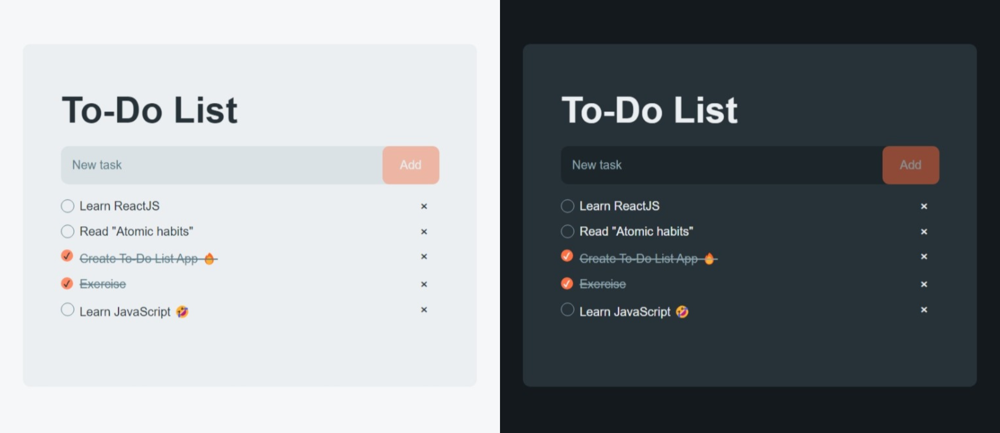

# To-Do List (HTML,CSS,JavaScript)

This ToDoList has been developed using HTML, CSS, and Vanilla JavaScript.

 ## Features
  - Add new task.
  - Delete task.
  - Check mark the completed task.
  - Save task data in LocalStorage.
  - Switch the theme from light to dark (or dark to light).

 ## Preview

 ## Credit
Icon: [Remix Icon](https://remixicon.com/)
